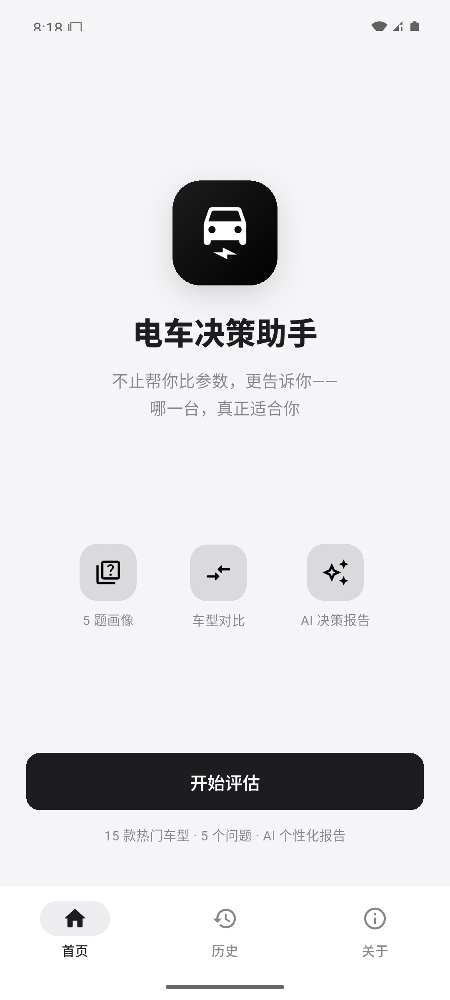
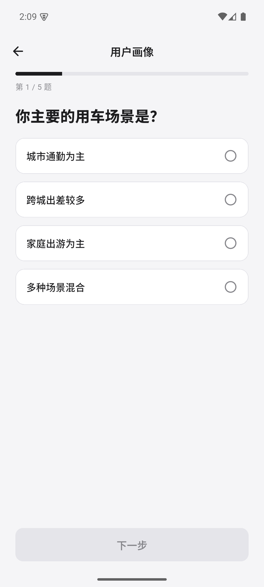
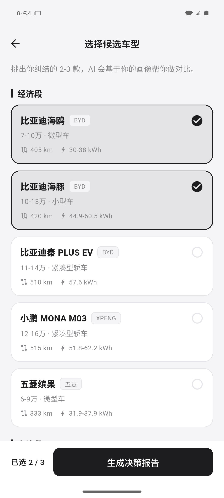
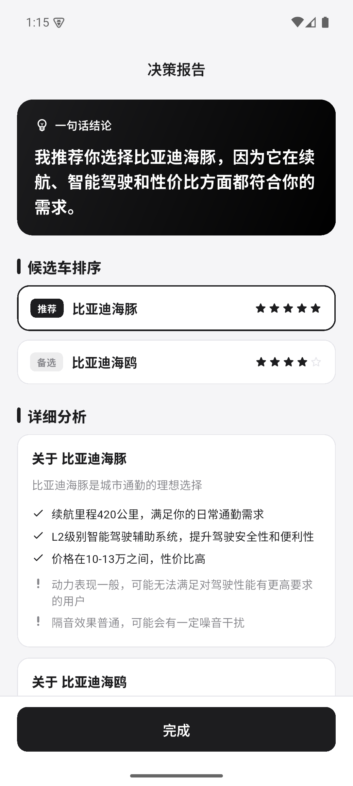
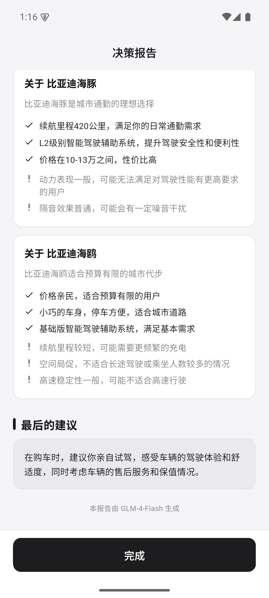

# 电车决策助手

一个基于 AI 的电动车购买决策助手。不只是比参数，而是结合你的实际用车场景、预算和偏好，告诉你——**候选车里，哪一台真正适合你**。

## 缘起

开发者本人过去三个月在比亚迪海豹 06 GT 和小鹏 MONA M03 之间纠结，意识到电动车选购是普遍痛点——参数对比工具一大堆，但没人告诉用户"对你来说哪个更合适"。这个 App 就是想解决这"最后一公里"。

## 功能

- 5 题引导式问卷，刻画用户画像（场景 / 里程 / 充电条件 / 预算 / 偏好）
- 15 款热门电动车，覆盖 8 万–35 万 三个价位段
- 调用 **智谱 GLM-4-Flash** 生成个性化决策报告：
  - 一句话结论（黑色高对比卡片）
  - 候选车排序 + 星级
  - 针对当前用户的 ✓ / ! 单色分析
  - 最终建议
- 报告自动落库到 SQLite，历史记录可重看、左滑删除
- 苹果式黑白极简设计语言
- AI 不可用时自动切换到本地规则引擎兜底，体验不中断

## 演示

| 欢迎 | 问卷 | 选车 | 报告（结论） |
|------|------|------|------|
|  |  |  |  |

| 报告（详细分析 + 建议） | 历史记录 |
|------|------|
|  |  |

## 技术栈

- **Flutter 3.44 / Dart 3.12** — 跨平台 UI 框架
- **Provider** — 简单可靠的状态管理
- **sqflite** — SQLite 本地持久化
- **dio** — HTTP 客户端
- **智谱 GLM-4-Flash** — 大模型 API（OpenAI 兼容接口）
- **Material 3** — 主题与组件

## 项目结构

```
lib/
  main.dart                       入口 + 主题 + Provider
  theme/app_theme.dart            黑白极简主题
  models/                         数据模型
    car.dart, survey.dart
    evaluation.dart, ai_report.dart
  data/                           数据访问
    car_repository.dart           读 assets/cars.json
    db_service.dart               SQLite CRUD
  providers/                      状态
    assessment_provider.dart
  services/                       业务逻辑
    llm_service.dart              调 GLM 生成报告
    llm_config.dart               配置（已 gitignored）
    llm_config.example.dart       配置模板
    report_engine.dart            本地报告引擎 / 兜底
  screens/                        页面
    home_shell.dart               底部导航容器
    home_tab.dart                 欢迎首页
    survey_screen.dart            5 题问卷
    car_select_screen.dart        候选车选择
    loading_screen.dart           加载（调用 LLM）
    report_screen.dart            决策报告
    history_screen.dart           历史记录
    about_screen.dart             关于
assets/cars.json                  15 款车型数据
docs/                             交付文档
  PRD.md
  prompt-design.md
```

## 本地运行

需要 Flutter SDK ≥ 3.24，Android Studio（含 SDK 36 / build-tools / 模拟器），JDK 17。

```bash
git clone <repo>
cd ev_decision

# 配置大模型 Key（可选，不配走本地兜底）
cp lib/services/llm_config.example.dart lib/services/llm_config.dart
# 编辑 lib/services/llm_config.dart，把 apiKey 替换成你的智谱 Key
# 申请地址：https://open.bigmodel.cn  → 控制台 → API Keys

flutter pub get
flutter run            # 在已连接的 Android 设备/模拟器上运行
```

构建 Release APK：

```bash
flutter build apk --release
# 输出：build/app/outputs/flutter-apk/app-release.apk
```

## Vibe Coding 实录

本项目以 **Vibe Coding** 模式开发：Cursor + Claude Code，目标 48 小时内从需求到 Release APK，作为 AI 产品工程师方向的能力证明。

设计取向：

- **诚实工程**：报告页明确区分"AI 生成"和"本地兜底"，不假装
- **可扩展抽象**：`LlmService` 与具体厂商解耦，换 DeepSeek / 通义只改配置
- **优先视觉**：报告页没有用 Markdown 渲染、改用结构化数据套布局，保留精心设计
- **可演示性**：AI Key 缺失时本地引擎兜底，演示绝不开天窗

## License

MIT
